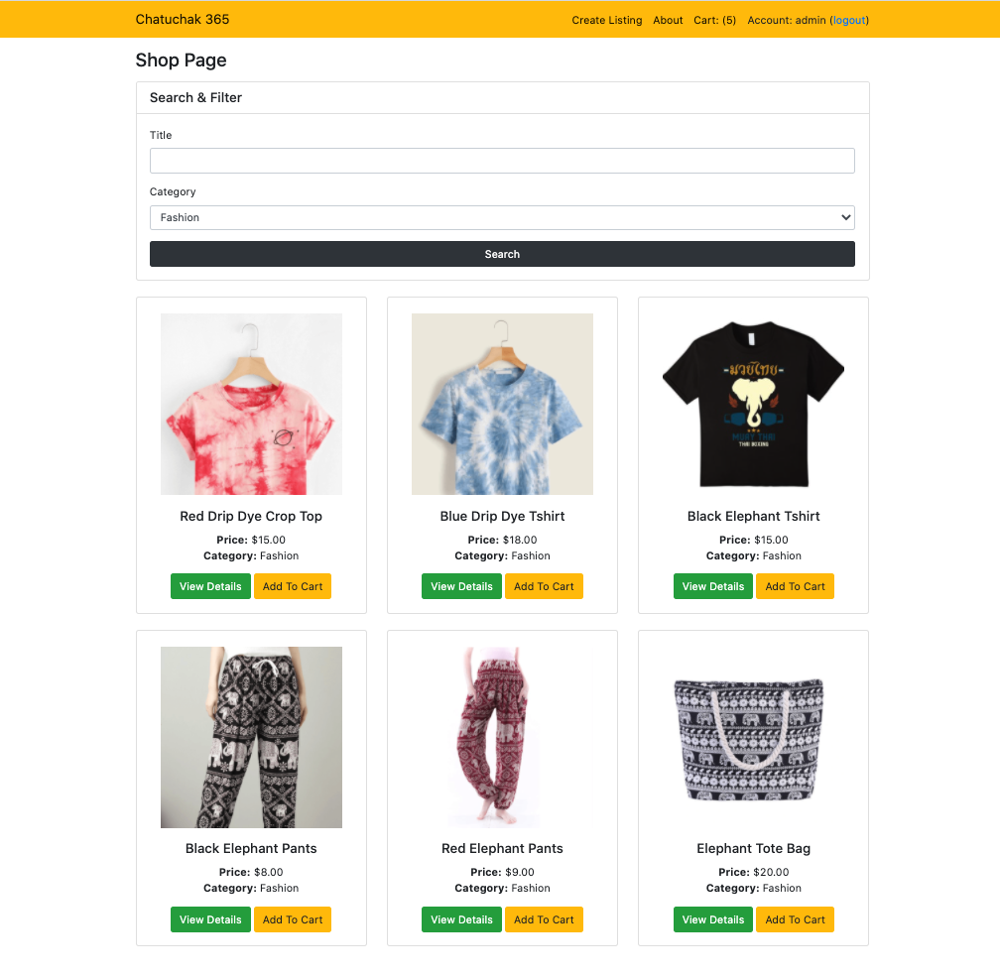
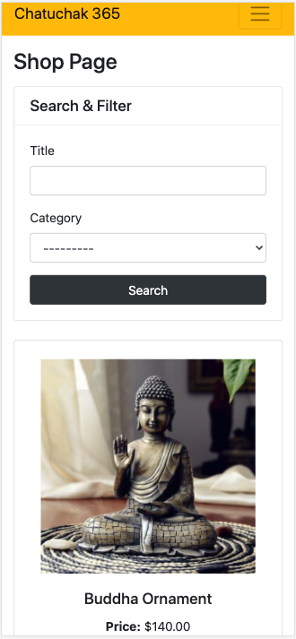

# Chatuchak 365

## Full Stack Frameworks with Django Milestone Project
A demo of this project can be viewed [here](https://jyf-tgc8-ecommerce.herokuapp.com/about/).

- This website, "Chatuchak 365", is an ecommerce platform listing Southeast Asian street market products. The website name is inspired by "Chatuchak", Thailand's largest street market, with over 15,000 stalls, 11,500 vendors, 200k+ weekly physical visitors, over an area of 25 acres (which is 26 football fields). Products at Chatuchak includes clothing and accessories, furniture, food and beverage, antiques, and more.
- With the Covid-19 pandemic, it has become increasingly difficult for locals and tourists to travel and visit such vibrant street markets, and for local businesses to sell offline to maintain their livelihoods.
- Therefore, "365" represents the concept of "Chatuchak" going online, being accessible all year round, anytime, anywhere. This is especially important during a pandemic like this.
- Chatuchak 365 simply aims to help Southeast Asian locals maintain their livelihood through ecommerce, while providing an avenue for international visitors to continue to shop for the street market products that they love.
- Visitors may browse as guest, or create a basic account if they'd like to add products to cart and checkout
- Potential sellers will be given an admin (superuser) account where they're able to upload and manage their listings (with access rights for CRUD operations).

Below are the sample test accounts for project demo:
| Account Type | Username |Password | Access Rights |
|----------|----------|----------|----------|
| Superuser | admin | ecommerce123 | All features, include add / edit / delete listings|
| Basic user | shopee | amazon123 | View listings, add to cart, checkout |
| Guest | - | - | View listings |

- Guests may also create their own new account on the website, which will be automatically qualified as a basic user.
- Superuser accounts can only be created upon request, or testers may use the sample superuser account provided.

## UX

### Strategy - User Stories
There are 2 groups of users for Chatuchak 365: buyers and sellers.

Buyers would use the website to:
- Browse listings on the wesbite, which is sorted by time, and can be filtered by category.
- Utilise search and filter functionalities to identify specific listings.
- View listings in product detail page, which will contain more description about the listing.
- Add multiple listings to cart.
- Checkout the cart, and provide payment via STRIPE's interface, which is internationally recognised, trusted, and secure.

Sellers would use the website to: 

- Add new listings, which contains information such as product title, description, category, and image
- Update / delete existing listing information if adjustments need to be made

In addition, the site owner may also use the website for the following objectives:
- Monetise the website via advertsement revenue if traffic is high enough
- Charge a small comission fee per transcation (this feature can be built in the future) between the buyer and seller, which can be channeled to maintaing and building more features for the website

### Structure & Intended User Behavior
- The navbar contains all major modules present in the website, explained below:
- **Login:** Here, user may login / logout, or create a new account if they'd like to. Logged in accounts will see their username displayed on the top right hand corner of the navbar, or in the navbar dropdown in mobile screens. Guest have access to listing pages. Registered basic account have access to cart and checkout pages. Superusers have access to all pages, including add / edit / delete listing functionalities. 
- **Add listing:** Superusers may create new listings with this feature, which will lead them to a page till fill up a new listings' product title, description, category, price, and product image. This entry point is hidden from normal users and guests.
- **View listings:** View listings page can be accessed by anyone. This page can be accessed by clicking on the "Chatuchak 365" text on the navbar. Here, sellers may view all listings as shown (sorted by upload / update time), or they may leverage on the search and filter functionalities to look for specific listings. All listings are displayed as cards on the main page. Cards are used as it allows listing images to be prioritised and shown visually to buyers, with a call to action to either view more details about the listing, or to add to cart. If a visitor wish to find out more about the listing, he may visit the product detail page of each listing, which contains full information about the listing For admin (superusers), the listing detail page also shows edit / delete functionalities, which allows the listing to be edited / deleted in a step-by-step manner to prevent accidental edit or delete mistakes. 
- **Cart:** : The cart page can be accssed from the navbar. A user needs to be logged in to a basic account to access this page. Everytime a seller adds a new listing to cart, the number of items in cart will be shown in brackets, next to the cart text, i.e. cart (3) shows that there are 3 items in the cart. In the cart page, buyers will see the list of items they have added to cart, and its repective detail. The quantity of products can be adjusted in cart page. The product can also be removed from the cart page if needed. The cart page shows a table view in large screen, and card view in small screen, which optimises the user experience in both scenario. Once the user is satisfied with the listings in the cart, the user may proceed to checkout, which will lead to the payment page.
- The **payment page** (via STRIPE API) will then require the buyer to fill in his particulars and credit card information before a successful checkout.
- **About:** The website contains an "about page" which explains the background, objectives, and content of the website

### User Interface & Design
Functionality and clarity was the main focus and reason behind the colour scheme and typography choice. A yellow navbar is the chosen theme because it represents action and excitement behind an ecommerce concept. The background is kept as white, so as to allow users to focus instead on the listing images generated on the cards. White is also a comforatble background color when buyers are checking their cart items, and making credit card payment in the payment page. Links and buttons are all labelled with words, so there is no misunderstanding for users of the website. If time and resource permits, the colour scheme and styling should be revisited and improved to offer something unique for the community. 

## Features

### Current Features
#### Feature for Guests (Non logged-in account)
- Ability to visit the about page
- Ability to visit all listing pages, and use the search (by product title) feature, or filter (by category) feature
- Ability to view specific listing's product detail page to see more information
- Ability to add listing to cart (but unable to access cart page)
- Ability to create new account

#### Feature for Normal Users (any guest can create a normal / basic account)
- Ability to sign-in, sign out 
- Ability to visit all feature set for guests (as above)
- Ability to enter cart page to see listings added to cart
- Ability to edit quantity of each listing in cart for purchase
- Ability to delete each listing line item in cart
- Ability to checkout cart
- Ability to provide payment for checkout cart via Stripe

#### Feature for Admin / Super User
- Ability to visit all feature set for guest and normal users (as above)
- Ability to add new listing
- Ability to edit existing listing
- Ability to delete existing listing

### Potential Features to Further Implement:
- Adding of seller / vendor management modules, to allow sellers to view order details and track order status
- Adding of like / wishlist feature per listing, for users to save listings into a wishlist to keep track, before checkout
- Adding of review feature, for buyers to leave a review of the product, so other users can make a better purchase decision, and sellers can improve on their products and services
- Adding of chat feature, so buyers and sellers can find out more about a product before making a transaction

## Technologies Used
- Python
- HTML
- CSS
- JavaScript
- [Django](https://www.djangoproject.com/)
- [django-allauth](https://django-allauth.readthedocs.io/en/latest/overview.html) for user authentication
- [django-crispy-forms](https://django-crispy-forms.readthedocs.io/en/latest/) for form styling
- [django-mathfilters](https://pypi.org/project/django-mathfilters/) for template calculations
- [dotenv](https://pypi.org/project/python-dotenv/) to use environment variables
- [PostgreSQL](https://www.postgresql.org/) as the database
- [psycopg2](https://pypi.org/project/psycopg2/) as the PostgreSQL database adapter for Python
- [Heroku](https://www.heroku.com/) to host the web app
- [gunicorn](https://gunicorn.org/) as the Python WSGI HTTP Server for deployment
- [WhiteNoise](http://whitenoise.evans.io/en/stable/) to simply static file serving
- [Cloudinary](https://cloudinary.com/) for image upload and media management
- [Stripe](https://stripe.com/) to handle payments
- [Bootstrap](https://getbootstrap.com/docs/4.5/getting-started/introduction/) for web page styling
- [GitHub](https://github.com/) for source control

## Programming Methodologies
- .env file was used to store environment variables so that secret keys credentials were not publicly viewable.
- git and GitHub for source control

## Database Design
The following Django models were created:
1. Users - contain user information
2. Listings - contain listing information
3. Categorys - contain listing category's information
4. Purchases - contain confirmed purchases made by users

The relationship between the models are illustrated in [this ER diagram](report/ERD.png).

## Testing
All testing was done manually, with the following tests performed. Please note that sample normal and superuser account and password has been provided in the first section (above) of this README file.
|  # | Event | Expected Outcome | Actual Outcome |
|----|-------|------------------|----------------|
|  1 | as guest, browse about page| able to access about page | As expected |
|  2 | as guest, browse listing page | able to access listing page and see all listings | As expected |
|  3 | as guest, try searching for a listing by title, click search button when done | able to see listings with title that only match keyword searched | As expected |
|  4 | as guest, try sorting listing by category, click search button when done | able to see listings with category that match category filtered | As expected |
|  5 | as guest, view listings' detail, and enter listing detail page | able to enter product detail page | As expected |
|  6 | as guest, add item to cart | able to add item to cart, cart in navbar increments by (+1)  | As expected |
|  7 | as guest, go to cart | unable to enter cart page, guest is redirected to sign in or create account | As expected |
|  8 | as guest, register for a new account | able to register for new account with email, account name, password keyed in. account is logged into automatically | As expected |
|  9 | as guest, logout of account | able to logout of account | As expected |
| 10 | as guest, login to existing account | able to login to existing account | As expected |
| 11 | as normal user, perform above scenarios | the above step 1-7 that guest visitor can view, can be successfully executed by a normal account user| As expected |
| 12 | as normal user, enter cart page | able to enter cart page, and view all listings added to cart | As expected |
| 13 | as normal user, adjust the quantity of purchase in cart page | able to edit quantity of listings in cart | As expected |
| 14 | as normal user, delete line item in cart | able to delete listing item in cart | As expected |
| 15 | as normal user, perform cart checkout | able to checkout and proceed to payment page | As expected |
| 16 | as normal user, make stripe payment by entering any email address, 4242 4242 4242 4242 for credit card detail, any credit card expiry date as long as it is in a future date, and any CCV number, then click pay | able to make successful credit card payment, afterwhich, user is directed to a thank you for shopping page, with contact information of the site owner incase there are any enquiries | As expected |
| 17 | logout of normal user, login as admin / superuser | able to login as superuser | As expected |
| 18 | as superuser, perform above features guest and normal user can perform | the above step 1-7 that guest visitor can do, and step 12-16 that a normal user can do, can all be successfully executed by a superuser account| As expected |
| 19 | as superuser, add new listing from navbar entrypoint | able to enter create listing page, fill in listing fields, images, and successfully upload a listing, which will be appended to the bottom of the listing page | As expected |
| 20 | as superuser, enter individual product page, and edit listing detail | able to edit existing listing, alter any field, reupload a new image, and submit. edited listing will display edited information in both the listing page and the product detail page. | As expected |
| 21 | as superuser, enter individual product page, and delete existing listing | able to delete existing listing, which will be completely removed from the website. there will be an intermediate step to ask the superuser to confirm the delete, incase there are any second thoughts in between the process. | As expected |
| 22 | repeat above steps in PC / Mobile view | UI is optimised for both PC and mobile for all pages, functionalities are retained for both interfaces | As expected |

## Deployment Steps
A live demo of this project can be viewed [here](https://jyf-codebuddy.herokuapp.com/).
All the source code for this project is available [here](https://github.com/jyfoo213/CodeBuddy) on GitHub.

Code for the project was committed to GitHub in the following manner:
- Individual files were added to the next commit staging area by executing the `git add [filename]` command in a command-line interface.
- All changes in the working directory were added to the next commit (stage) by executing the `git add .` command in a command-line interface.
- Staged content was committed as new commit snapshot by executing the `git commit -m “[message]"` command in a command-line interface.
- Local branch commits were pushed to the remote repository master branch by executing the `git push -u origin master` command in a command-line interface.
- Subsequent local branch commits were pushed to the remote repository master branch by executing the `git push` command in a command-line interface.

Deployment to Heroku was performed in a debian based linux environment bash terminal in the following manner:
- Install Heroku on local machine: `sudo snap install heroku --classic`
- Log into Heroku: `heroku login -i`
- Create a new heroku app: `heroku create <app-name>`
- Verify that the correct remotes have been added: `git remote -v`
- Setup a python virtual environment in the root folder of the project: `python3 -m venv venv`
- Activate the python virtual environment whilst being in the root folder of the project: `source venv\bin\activate`
- Install the dependencies: `pip install dnspython Flask Flask-Login gunicorn passlib pymongo python-dotenv`
- Create requirements.txt file to store dependencies `pip freeze > requirements.txt`

Using a file manager:
- Create a file named `Procfile` without speech-marks or file extension and save `web gunicorn <main flask file name without .py>:app` on the first line of `Procfile` (in my case, the contents of the Procfile was `web gunicorn app:app`)

Using a web browser:
- Log into [Heroku](https://id.heroku.com/login) and set environment variables for `SECRET_KEY = <your own key>`, `MONGO_URI = <your MongoDB URI>`

Back in the bash terminal:
- Commit all new changes to GitHub: `git add .` then `git commit -m “[message]"` then `git push`
- Finally, push to Heroku: `git push heroku master`

## Run locally on PC
- Clone the [repository](https://github.com/jyfoo213/CodeBuddy)
- Setup a python virtual environment in the root folder of the project: `python3 -m venv venv`
- Activate the python virtual environment whilst in the root folder of the project: `source venv\bin\activate`
- Install the dependencies: `pip install -r requirements.txt`
- In root folder of project, create a `.env` file and set the following environment variables: `export SECRET_KEY = <your own key>`, `export MONGO_URI = <your MongoDB URI>`, `export PORT = <your chosen port>`
- Run the web app `python app.py`
- Use a web browser to navigate to `localhost:<your chosen port>`

## Minor Issues
- When a admin needs to update a listing, the image field has to be re-uploaded. This is a known issue of Cloudinary, the 3rd party image hosting server used. Further enhancements in the future can be to allow existing product images to be retained when a user wants to update the listing.

## Credits
- Code institues instructor Paul Chor for development guidance
- Teaching assistant John Benedict for helping with troubleshooting of bugs
- Reddit / Quora / Stackoverflow as website inspiration
